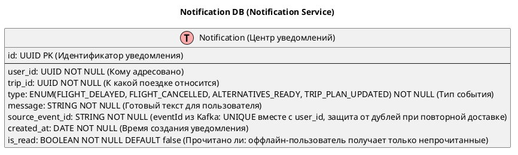

```plantuml
@startuml
!define Table(name,desc) entity name as "desc" << (T,#FFAAAA) >>
title Notification DB (Notification Service)

Table(Notification, "Notification (Центр уведомлений)") {
  id: UUID PK (Идентификатор уведомления)
  --
  user_id: UUID NOT NULL (Кому адресовано)
  trip_id: UUID NOT NULL (К какой поездке относится)
  type: ENUM(FLIGHT_DELAYED, FLIGHT_CANCELLED, ALTERNATIVES_READY, TRIP_PLAN_UPDATED) NOT NULL (Тип события)
  message: STRING NOT NULL (Готовый текст для пользователя)
  source_event_id: STRING NOT NULL (eventId из Kafka: UNIQUE вместе с user_id, защита от дублей при повторной доставке)
  created_at: DATE NOT NULL (Время создания уведомления)
  is_read: BOOLEAN NOT NULL DEFAULT false (Прочитано ли: оффлайн-пользователь получает только непрочитанные)
}

@enduml
```
