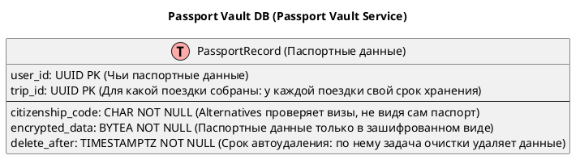

```plantuml
@startuml
!define Table(name,desc) entity name as "desc" << (T,#FFAAAA) >>
title Passport Vault DB (Passport Vault Service)

Table(PassportRecord, "PassportRecord (Паспортные данные)") {
  user_id: UUID PK (Чьи паспортные данные)
  trip_id: UUID PK (Для какой поездки собраны: у каждой поездки свой срок хранения)
  --
  citizenship_code: CHAR NOT NULL (Alternatives проверяет визы, не видя сам паспорт)
  encrypted_data: BYTEA NOT NULL (Паспортные данные только в зашифрованном виде)
  delete_after: TIMESTAMPTZ NOT NULL (Срок автоудаления: по нему задача очистки удаляет данные)
}

@enduml
```
