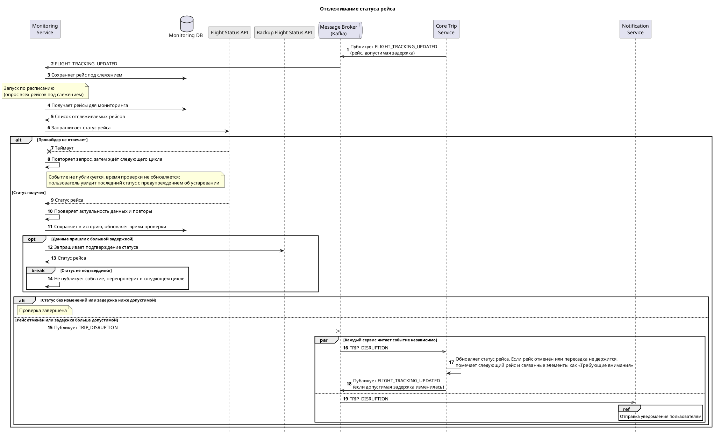

```plantuml
@startuml
title Отслеживание статуса рейса
hide footbox
autonumber

participant "Monitoring\nService" as MON
database "Monitoring DB" as MDB
participant "Flight Status API" as FS #E8E8E8
participant "Backup Flight Status API" as RP #E8E8E8
queue "Message Broker\n(Kafka)" as KF
participant "Core Trip\nService" as CT
participant "Notification\nService" as NT

CT ->> KF : Публикует FLIGHT_TRACKING_UPDATED\n(рейс, допустимая задержка)
KF ->> MON : FLIGHT_TRACKING_UPDATED
MON -> MDB : Сохраняет рейс под слежением

note over MON : Запуск по расписанию\n(опрос всех рейсов под слежением)

MON -> MDB : Получает рейсы для мониторинга 
MDB --> MON : Список отслеживаемых рейсов

MON -> FS : Запрашивает статус рейса

alt Провайдер не отвечает
  FS --x MON : Таймаут
  MON -> MON : Повторяет запрос, затем ждёт следующего цикла
  note right of MON : Событие не публикуется, время проверки не обновляется:\nпользователь увидит последний статус с предупреждением об устаревании

else Статус получен
  FS --> MON : Статус рейса
  MON -> MON : Проверяет актуальность данных и повторы
  MON -> MDB : Сохраняет в историю, обновляет время проверки

  opt Данные пришли с большой задержкой
    MON -> RP : Запрашивает подтверждение статуса
    RP --> MON : Статус рейса

    break Статус не подтвердился
      MON -> MON : Не публикует событие, перепроверит в следующем цикле
    end
  end

  alt Статус без изменений или задержка ниже допустимой
    note over MON : Проверка завершена

  else Рейс отменён или задержка больше допустимой
    MON ->> KF : Публикует TRIP_DISRUPTION

    par Каждый сервис читает событие независимо
      KF ->> CT : TRIP_DISRUPTION
      CT -> CT : Обновляет статус рейса. Если рейс отменён или пересадка не держится,\nпомечает следующий рейс и связанные элементы как «Требующие внимания»
      CT ->> KF : Публикует FLIGHT_TRACKING_UPDATED\n(если допустимая задержка изменилась)
    else
      KF ->> NT : TRIP_DISRUPTION
      ref over NT : Отправка уведомления пользователям
    end
  end
end
@enduml
```
