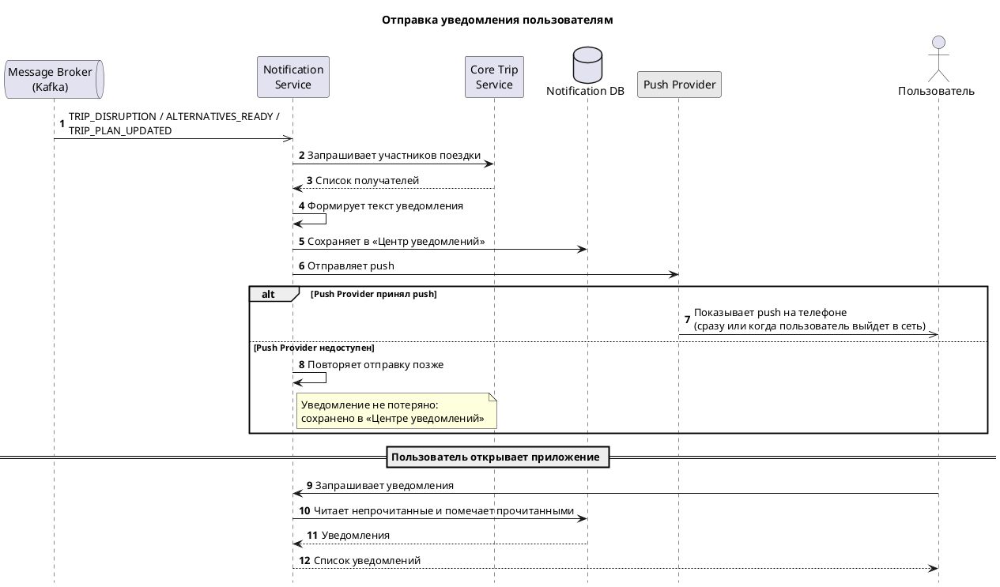

```plantuml
@startuml
title Отправка уведомления пользователям
hide footbox
autonumber

queue "Message Broker\n(Kafka)" as KF
participant "Notification\nService" as NT
participant "Core Trip\nService" as CT
database "Notification DB" as DB
participant "Push Provider" as PP #E8E8E8
actor "Пользователь" as U

KF ->> NT : TRIP_DISRUPTION / ALTERNATIVES_READY /\nTRIP_PLAN_UPDATED

NT -> CT : Запрашивает участников поездки
CT --> NT : Список получателей

NT -> NT : Формирует текст уведомления

NT -> DB : Сохраняет в «Центр уведомлений»

NT -> PP : Отправляет push

alt Push Provider принял push
  PP ->> U : Показывает push на телефоне\n(сразу или когда пользователь выйдет в сеть)
else Push Provider недоступен
  NT -> NT : Повторяет отправку позже
  note right of NT : Уведомление не потеряно:\nсохранено в «Центре уведомлений»
end

== Пользователь открывает приложение ==

U -> NT : Запрашивает уведомления
NT -> DB : Читает непрочитанные и помечает прочитанными
DB --> NT : Уведомления
NT --> U : Список уведомлений
@enduml
```
